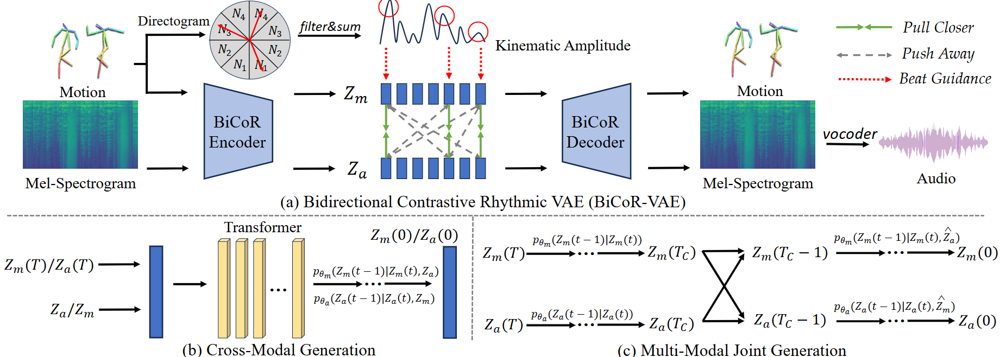

{:.no_toc}

## Overview

Motion-to-music and music-to-motion have been studied separately, each attracting substantial research interest within their respective domains. The interaction between human motion and music is a reflection of advanced human intelligence, and establishing a unified relationship between them is particularly important. However, to date, there has been no work that considers them jointly to explore the modality alignment within. To bridge this gap, we propose a novel framework, termed MoMu-Diffusion, for long-term and synchronous motion-music generation. Firstly, to mitigate the huge computational costs raised by long sequences, we propose a novel Bidirectional Contrastive Rhythmic Variational Auto-Encoder (BiCoR-VAE) that extracts the modality-aligned latent representations for both motion and music inputs. Subsequently, leveraging the aligned latent spaces, we introduce a multi-modal diffusion Transformer model and a cross-guidance sampling strategy to enable various generation tasks, including cross-modal, multi-modal, and variable-length generation. Extensive experiments demonstrate that MoMu-Diffusion surpasses recent state-of-the-art methods both qualitatively and quantitatively, and can synthesize realistic, diverse, long-term, and beat-matched music or motion sequences.

## Model Architecture

An overview of the proposed MoMu-Diffusion framework. MoMu-Diffusion contains two integral components: a bidirectional contrastive rhythmic Variational Autoencoder (BiCoR-VAE) designed to learn the aligned latent space, and a diffusion transformer model responsible for sequence generation. This framework is adept at facilitating both cross-modal and multi-modal joint generations, offering a robust approach to the integrated synthesis of motion and music.

<table>
    <tr>
        <td >
 
</td>
    </tr>
</table>

Figure.1 The overall architecture of MoMu-Diffusion.

## Motion to Music

<video width="400" height="250" controls>
  <source src="assets/motion2music/dance/3_with_new_audio.mp4" type="video/mp4">
  Your browser does not support the video tag.
</video>

<table>
    <tr>
        <td>
            

                
            

        </td>
    </tr>
</table>

<video width="400" height="250" controls>
  <source src="assets/motion2music/dance/62_with_new_audio.mp4" type="video/mp4">
  Your browser does not support the video tag.
</video>

<table>
    <tr>
        <td>
            

                
            

        </td>
    </tr>
</table>